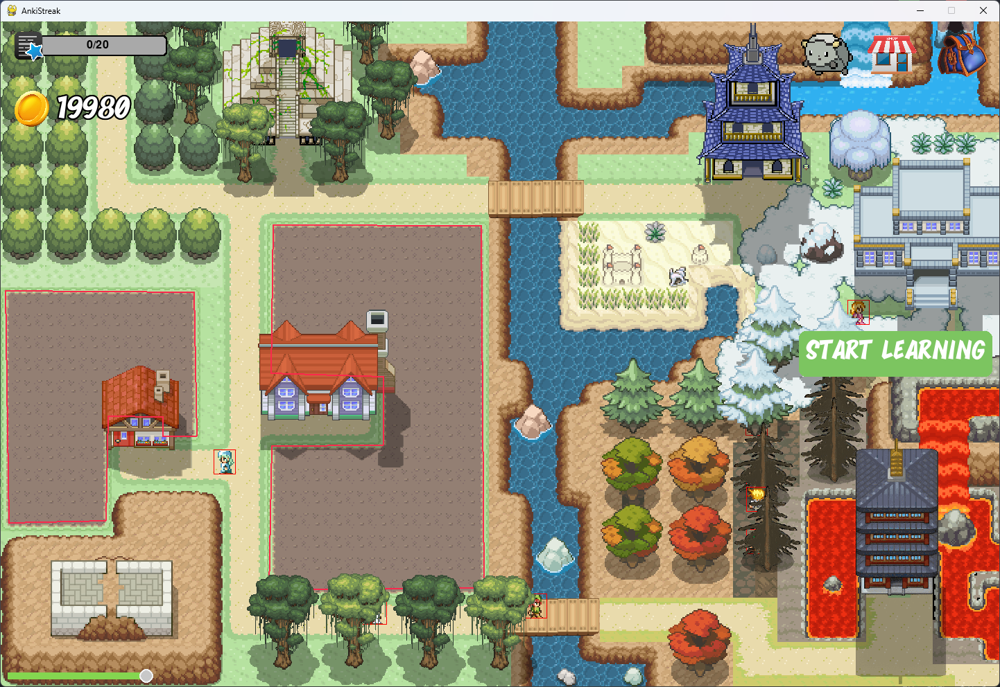

# AnkiStreak



https://github.com/Times0/AnkiStreak/assets/45049767/7273d494-6562-44d9-a4f8-c58063264d92


# How to run

```bash
git clone this repo
cd AnkiStreak
python build.py
```

The build tool will put the game in the anki addon folder.
It will also set the debug mode to False.

It will install all the requirements that anki needs to run the game in Python 3.9.

If you get errors (for example when installing scipy). Good luck bro.

